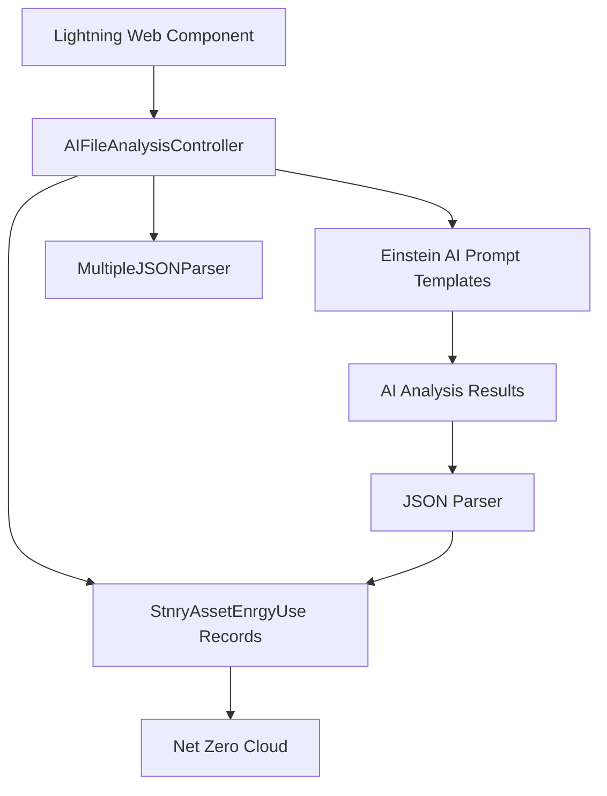

# 📋 NZC LLM Bill Ingestor

> **A powerful AI-powered solution for automated bill processing and energy consumption tracking in Salesforce Net Zero Cloud**

[](https://salesforce.com)
[](https://help.salesforce.com/s/articleView?id=sf.net_zero_cloud_intro.htm)
[](https://developer.salesforce.com/docs/platform/lwc/guide)

## 🚀 Quick Deploy

<div align="center">

[](https://githubsfdeploy.herokuapp.com?owner=salesforce-misc&repo=NZC-LLM-Bill-Ingestor&ref=main)

**One-click deployment to your Salesforce org**

> **Note:** If you encounter authentication issues, you may need to authorize the GitHub Salesforce Deploy Tool to access the `salesforce-misc` organization. Alternatively, use the [Salesforce CLI deployment method](#-option-3-salesforce-cli-deployment) below.

</div>

---

## ✨ Features

### 🤖 **AI-Powered Analysis**
- **Smart Bill Processing**: Leverages Einstein AI to automatically extract key information from utility bills
- **Multi-Format Support**: Processes various file formats including images and PDFs
- **Intelligent Data Extraction**: Automatically identifies account names, consumption data, and billing periods

### 🏗️ **Salesforce Integration**
- **Net Zero Cloud Compatible**: Seamlessly integrates with Salesforce Net Zero Cloud for sustainability tracking
- **Lightning Web Components**: Modern, responsive UI built with Lightning Web Components
- **Flow Integration**: Includes pre-built flows for automated record processing
- **Energy Use Record Creation**: Automatically creates `StnryAssetEnrgyUse` records from analyzed data

### 📊 **Energy Management**
- **Consumption Tracking**: Monitors electricity usage across multiple sites
- **Historical Data**: Maintains comprehensive records of energy consumption patterns
- **Multi-Site Support**: Handles bills containing data for multiple locations

---

## 🚀 Getting Started

### 📋 Prerequisites

Before you begin, ensure you have the following:

- ✅ **Salesforce Net Zero Cloud** licensed and configured
- ✅ **Git** installed on your local machine
- ✅ **Salesforce CLI** (latest version recommended)
- ✅ **Salesforce user** with deployment permissions
- ✅ **Active Salesforce org** (Sandbox or Developer Edition)
- ✅ **Einstein AI** features enabled in your org (Setup > Einstein Setup > Enable Turn on Einstein, if it's not already turned on)

### 🔧 Installation

Choose your preferred deployment method:

#### 🎯 Option 1: One-Click GitHub Deploy *(Recommended)*

Click the **"Deploy to Salesforce"** button above for instant deployment to your org.

#### 📦 Option 2: Workbench Deployment

For environments where GitHub access is restricted:

1. **Download** the pre-built deployment package:
   - Direct download: [NZC-LLM-Bill-Ingestor-Deploy.zip](./NZC-LLM-Bill-Ingestor-Deploy.zip)
   - Or download from the [GitHub Releases](https://github.com/salesforce-misc/NZC-LLM-Bill-Ingestor/releases) tab
2. **Navigate** to [Salesforce Workbench](https://workbench.developerforce.com/login.php)
3. **Login** to your target org
4. **Go to** Migration → Deploy
5. **Upload** the zip file and deploy

**Alternative Tools:** You can also deploy using [Salesforce Inspector](https://chrome.google.com/webstore/detail/salesforce-inspector/aodjmnfhjibkcdimpodiifdjnnncaafh) or the [Ant Migration Tool](https://developer.salesforce.com/docs/atlas.en-us.daas.meta/daas/forcemigrationtool_install.htm).

#### 🛠️ Option 3: Salesforce CLI Deployment

For developers who prefer command-line tools:

##### 3.1 Clone the Repository

```bash
git clone https://github.com/salesforce-misc/NZC-LLM-Bill-Ingestor.git
cd NZC-LLM-Bill-Ingestor
```

##### 3.2 Authorize Your Org

```bash
# For sandbox/production orgs
sfdx auth:web:login --setalias MyOrg --instanceurl https://test.salesforce.com

# For developer orgs
sfdx auth:web:login --setalias MyOrg
```

##### 3.3 Deploy the Metadata

```bash
# Deploy all components (Salesforce CLI v2)
sf project deploy start --source-dir force-app --target-org MyOrg

# Or using legacy sfdx command
sfdx force:source:deploy -p force-app -u MyOrg

# Or use CumulusCI (if configured)
cci flow run dev_org --org dev
```

**Note:** This accelerator is compatible with CI/CD tools like Gearset, Copado, and Flosum.

#### ⚡ Post-Deployment Configuration

After deploying with any method above, complete these manual steps:

1. **Enable Einstein AI Platform**
   - Navigate to Setup → Einstein Setup
   - Toggle on Turn on Einstein if not already enabled

2. **Access Prompt Template Builder**
   - Ensure you have access to Prompt Template Builder (Setup > Einstein Generative AI > Prompt Builder)
   - Verify the `Analyze_Files` prompt template is active

3. **Verify Einstein Credits**
   - Check that you have sufficient Einstein credits available (check Digital Wallet App, see [here](https://help.salesforce.com/s/articleView?language=en_US&id=xcloud.wallet_permissions.htm&type=5) for required permissions)
   - Credits are consumed per AI analysis request

4. **Configure Net Zero Cloud**
   - Ensure Net Zero Cloud is licensed and configured
   - Verify `StnryAssetEnrgyUse` object is available

5. **Add Component to Lightning Pages**
   - Follow the [Usage instructions](#-usage) below to add the component to your pages

---

## 🎯 Usage

### 📱 **Adding Components to Lightning Pages**

1. **Navigate** to the Stationary Asset Environmental Source Object Lightning Page
2. **Edit** the page using the Lightning App Builder
3. **Find** the `Image Analyzer` component in the Custom Components section
4. **Drag** the component to your desired location
5. **Configure** component properties as needed (flow name: Process_AI_Analysis_Result)
6. **Save** and **Activate** the page

### 🔄 **Processing Bills**

1. **Upload** a bill file using the Image Analyzer component
2. **Click** "Analyze with AI" to process the document
3. **Review** the extracted data in the results panel
4. **Click** "Create Energy Records" to automatically create `StnryAssetEnrgyUse` records
5. **Monitor** the progress and view created record links

### 📊 **Viewing Results**

- **Energy records** are automatically linked to your parent record
- **View created records** by clicking the provided links
- **Track consumption** patterns in Net Zero Cloud dashboards

---

## 🏗️ Technical Architecture

This accelerator contains the following metadata:
- **2 Lightning Web Components** (`imageAnalyzer`, `energyRecordDetail`)
- **2 Apex Classes** (`AIFileAnalysisController`, `MultipleJSONParser`)
- **1 Flow** (`Process_AI_Analysis_Result`)
- **1 Einstein AI Prompt Template** (`Analyze_Files`)

### Architecture Diagram



### 🧩 **Key Components**

| Component | Description |
|-----------|-------------|
| `imageAnalyzer` | Lightning Web Component for file upload and AI analysis |
| `AIFileAnalysisController` | Apex controller handling AI processing and record creation |
| `MultipleJSONParser` | Utility class for parsing complex JSON structures |
| `Process_AI_Analysis_Result` | Flow for additional processing workflows |

---

## 🤝 Contributing

We welcome contributions to improve the NZC LLM Bill Ingestor! Please follow these steps:

1. **Fork** the repository
2. **Create** a feature branch (`git checkout -b feature/amazing-feature`)
3. **Commit** your changes (`git commit -m 'Add amazing feature'`)
4. **Push** to the branch (`git push origin feature/amazing-feature`)
5. **Open** a Pull Request

### 📝 **Development Guidelines**

- Follow [Salesforce coding standards](https://developer.salesforce.com/docs/atlas.en-us.apexcode.meta/apexcode/apex_classes_best_practices.htm)
- Include comprehensive test coverage (>75%)
- Update documentation for new features
- Test thoroughly in multiple org types

---

## 📄 License

This project is licensed under the **MIT License** - see the [LICENSE.md](LICENSE.md) file for details.

---

## 🐛 How to Report Bugs

Found a bug or have a feature request? Please report it via [GitHub Issues](https://github.com/salesforce-misc/NZC-LLM-Bill-Ingestor/issues).

When reporting bugs, please include:
- Steps to reproduce the issue
- Expected vs. actual behavior
- Salesforce org version and edition
- Screenshots or error messages (if applicable)

## 🆘 Support

- 📚 **Documentation**: Check our [Wiki](https://github.com/salesforce-misc/NZC-LLM-Bill-Ingestor/wiki) for detailed guides
- 🐛 **Issues**: Report bugs via [GitHub Issues](https://github.com/salesforce-misc/NZC-LLM-Bill-Ingestor/issues)
- 💬 **Discussions**: Join the conversation in [GitHub Discussions](https://github.com/salesforce-misc/NZC-LLM-Bill-Ingestor/discussions)
- 📧 **Contact**: Reach out to the maintainers for enterprise support

## ⚠️ Disclaimer

**This accelerator is open-source, not an official Salesforce product, and is community-supported.** Salesforce does not provide official support for this accelerator. Use at your own risk and test thoroughly in a sandbox environment before deploying to production.

---

<div align="center">

**Made with ❤️ for the Salesforce Community**

⭐ **Star this repo** if you find it helpful!

</div>
