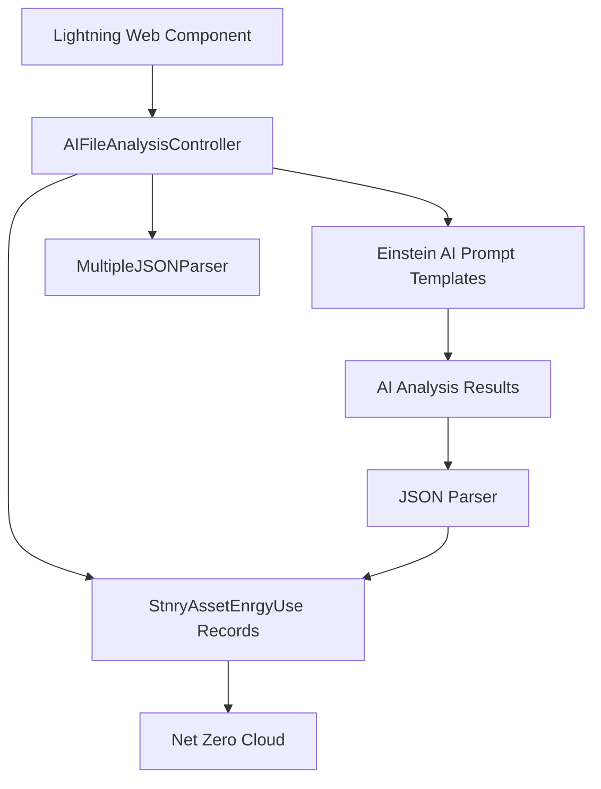

# 📋 NZC LLM Bill Ingestor

> **A powerful AI-powered solution for automated bill processing and energy consumption tracking in Salesforce Net Zero Cloud**

[](https://salesforce.com)
[](https://help.salesforce.com/s/articleView?id=sf.net_zero_cloud_intro.htm)
[](https://developer.salesforce.com/docs/platform/lwc/guide)

---

## ✨ Features

### 🤖 **AI-Powered Analysis**
- **Smart Bill Processing**: Leverages Einstein AI to automatically extract key information from utility bills
- **Multi-Format Support**: Processes various file formats including images and PDFs
- **Intelligent Data Extraction**: Automatically identifies account names, consumption data, and billing periods

### 🏗️ **Salesforce Integration**
- **Net Zero Cloud Compatible**: Seamlessly integrates with Salesforce Net Zero Cloud for sustainability tracking
- **Lightning Web Components**: Modern, responsive UI built with Lightning Web Components
- **Flow Integration**: Includes pre-built flows for automated record processing
- **Energy Use Record Creation**: Automatically creates `StnryAssetEnrgyUse` records from analyzed data

### 📊 **Energy Management**
- **Consumption Tracking**: Monitors electricity usage across multiple sites
- **Historical Data**: Maintains comprehensive records of energy consumption patterns
- **Multi-Site Support**: Handles bills containing data for multiple locations

---

## 🚀 Getting Started

### 📋 Prerequisites

Before you begin, ensure you have the following:

- ✅ **Salesforce Net Zero Cloud** licensed and configured
- ✅ **Git** installed on your local machine
- ✅ **Salesforce CLI** (latest version recommended)
- ✅ **Salesforce user** with deployment permissions
- ✅ **Active Salesforce org** (Sandbox or Developer Edition)
- ✅ **Einstein AI** features enabled in your org

### 🔧 Installation

#### 1️⃣ Clone the Repository

```bash
git clone https://github.com/your-username/NZC-LLM-Bill-Ingestor.git
cd NZC-LLM-Bill-Ingestor
```

#### 2️⃣ Authorize Your Org

```bash
# For sandbox/production orgs
sfdx auth:web:login --setalias MyOrg --instanceurl https://test.salesforce.com

# For developer orgs
sfdx auth:web:login --setalias MyOrg
```

#### 3️⃣ Deploy the Metadata

```bash
# Deploy all components
sfdx force:source:deploy -p force-app -u MyOrg

# Or use CumulusCI (if configured)
cci flow run dev_org --org dev
```

#### 4️⃣ Configure Einstein AI

Ensure your org has:
- Einstein AI Platform enabled
- Prompt Template Builder access
- Required Einstein credits available

---

## 🎯 Usage

### 📱 **Adding Components to Lightning Pages**

1. **Navigate** to your target Lightning Page (Home, Account, etc.)
2. **Edit** the page using the Lightning App Builder
3. **Find** the `Image Analyzer` component in the Custom Components section
4. **Drag** the component to your desired location
5. **Configure** component properties as needed
6. **Save** and **Activate** the page

### 🔄 **Processing Bills**

1. **Upload** a bill file using the Image Analyzer component
2. **Click** "Analyze with AI" to process the document
3. **Review** the extracted data in the results panel
4. **Click** "Create Energy Records" to automatically create `StnryAssetEnrgyUse` records
5. **Monitor** the progress and view created record links

### 📊 **Viewing Results**

- **Energy records** are automatically linked to your parent record
- **View created records** by clicking the provided links
- **Track consumption** patterns in Net Zero Cloud dashboards

---

## 🏗️ Architecture



### 🧩 **Key Components**

| Component | Description |
|-----------|-------------|
| `imageAnalyzer` | Lightning Web Component for file upload and AI analysis |
| `AIFileAnalysisController` | Apex controller handling AI processing and record creation |
| `MultipleJSONParser` | Utility class for parsing complex JSON structures |
| `Process_AI_Analysis_Result` | Flow for additional processing workflows |

---

## 🤝 Contributing

We welcome contributions to improve the NZC LLM Bill Ingestor! Please follow these steps:

1. **Fork** the repository
2. **Create** a feature branch (`git checkout -b feature/amazing-feature`)
3. **Commit** your changes (`git commit -m 'Add amazing feature'`)
4. **Push** to the branch (`git push origin feature/amazing-feature`)
5. **Open** a Pull Request

### 📝 **Development Guidelines**

- Follow [Salesforce coding standards](https://developer.salesforce.com/docs/atlas.en-us.apexcode.meta/apexcode/apex_classes_best_practices.htm)
- Include comprehensive test coverage (>75%)
- Update documentation for new features
- Test thoroughly in multiple org types

---

## 📄 License

This project is licensed under the **MIT License** - see the [LICENSE.md](LICENSE.md) file for details.

---

## 🆘 Support

- 📚 **Documentation**: Check our [Wiki](../../wiki) for detailed guides
- 🐛 **Issues**: Report bugs via [GitHub Issues](../../issues)
- 💬 **Discussions**: Join the conversation in [GitHub Discussions](../../discussions)
- 📧 **Contact**: Reach out to the maintainers for enterprise support

---

<div align="center">

**Made with ❤️ for the Salesforce Community**

⭐ **Star this repo** if you find it helpful!

</div>
